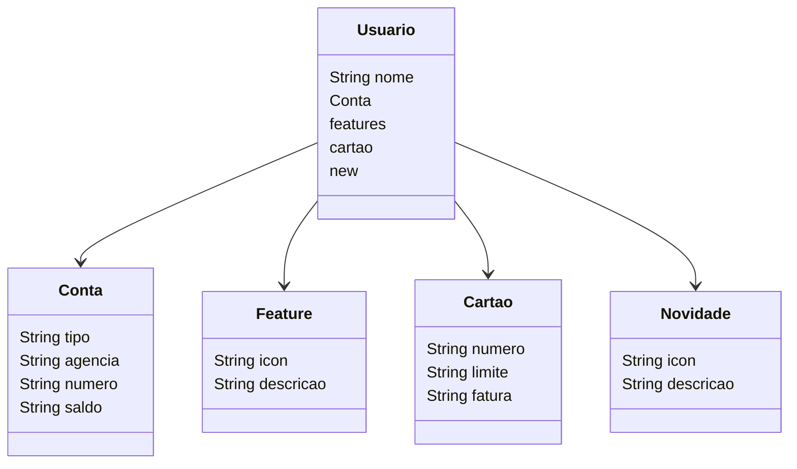

# Projeto - Decola Tech 2025
Java RESTful API

## Diagrama de Classes

```mermaid
classDiagram
    class Usuario {
        String nome
        Conta 
        features
        cartao
        new
    }

    class Conta {
        String tipo
        String agencia
        String numero
        String saldo
    }

    class Feature {
        String icon
        String descricao
    }

    class Cartao {
        String numero
        String limite
        String fatura
    }

    class Novidade {
        String icon
        String descricao
    }

    Usuario --> Conta
    Usuario --> Feature
    Usuario --> Cartao
    Usuario --> Novidade


```
# IMAGENS DO PROJETO

